# Order Processing System

Este documento tem como objetivo descrever as principais informações da aplicação Order-Processing-System

## Informações gerais

Aplicação visando gerenciar um sistema de ordens de pedidos

### Cadastro de novo usuário

| Método | URL                          | Descrição                 |
|--------|------------------------------|---------------------------|
| POST   | http://localhost:8080/users  | Cadastro de novo usuário  |

#### Entradas:

| Nome campo      | Tipo   | Descrição               |
|-----------------|--------|-------------------------|
| name            | String | Nome do usuário         |
| email           | String | Email do usuário        |
| phone           | String | Telefone do usuário     |
| password        | String | Cadastro de nova senha  |

#### Saída:

##### Status code 201 Created

| Nome campo     | Tipo   | Descrição              |
|----------------|--------|------------------------|
| id             | UUID   | `id` gerado pelo banco |
| name           | String | Nome do usuário        |
| email          | String | Email do usuário       |
| phone          | String | Telefone do usuário    |
| password       | String | Cadastro de nova senha |

###### Ex:
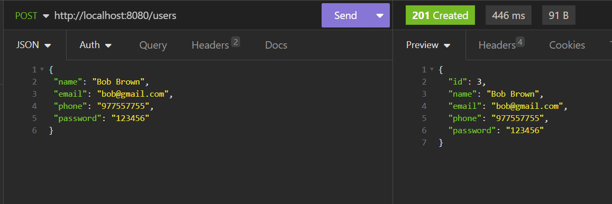

### Busca por todos os usuários cadastrados

| Método | URL                          | Descrição                                 |
|--------|------------------------------|-------------------------------------------|
| GET    | http://localhost:8080/users  | Busca por todos os usuários cadastrados   |

#### Saída:
##### Status code 200 OK

###### Ex:
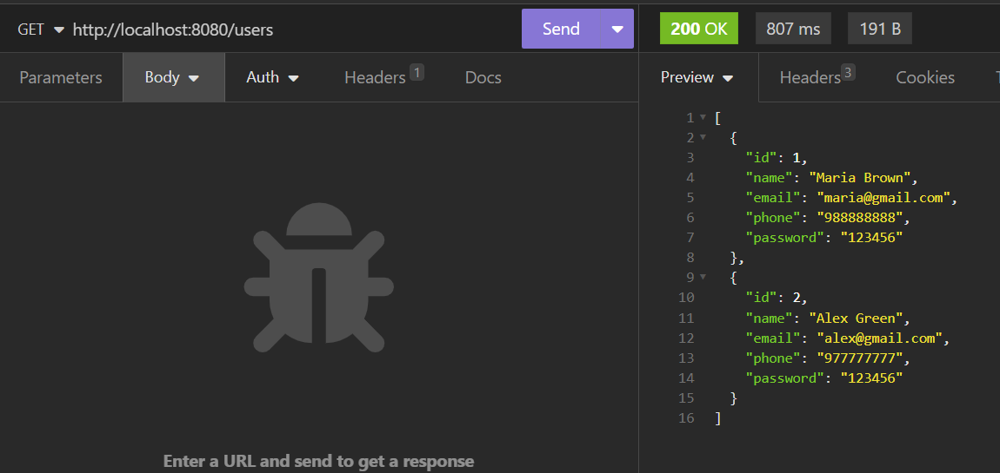

### Busca por todas as categorias de produtos

| Método | URL                              | Descrição                      |
|--------|----------------------------------|--------------------------------|
| GET    | http://localhost:8080/categories | Busca por todas as categorias  |

#### Saída:
##### Status code 200 OK

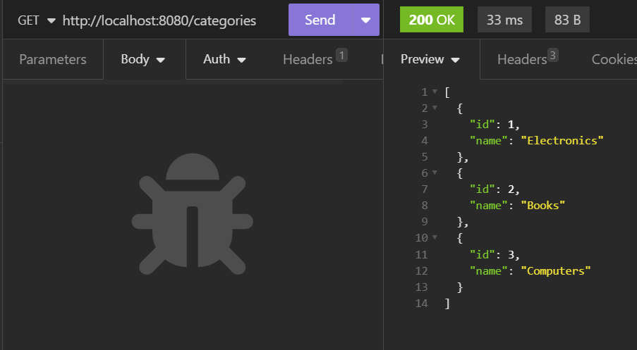

### Busca por todos os produtos cadastrados associados a suas categorias

| Método | URL                            | Descrição                   |
|--------|--------------------------------|-----------------------------|
| GET    | http://localhost:8080/products | Busca por todos os produtos |

#### Saída:
##### Status code 200 OK

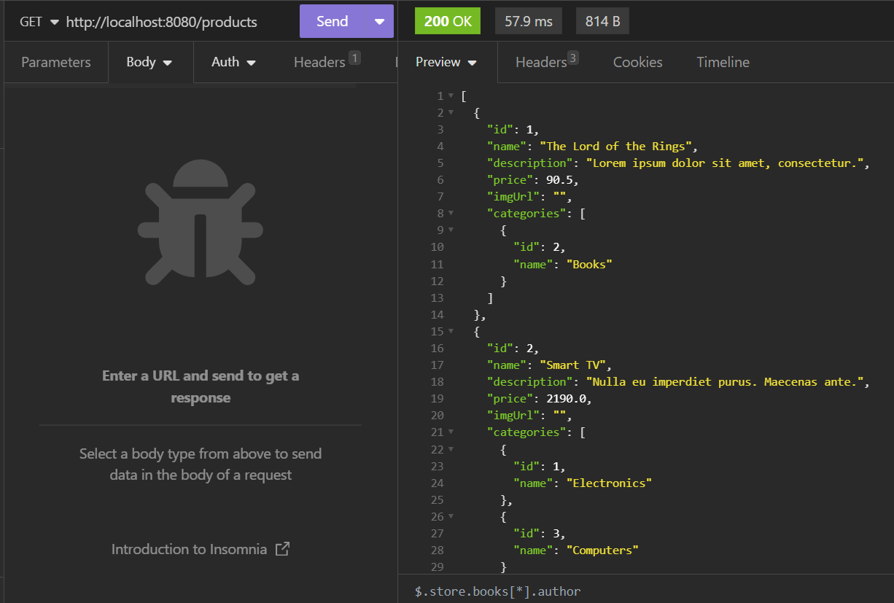

### Busca por todas as ordens de pedido, com a quantidade, usuário e produtos associados, subtotal por itens e total para cada ordem de pedido

| Método | URL                          | Descrição                            |
|--------|------------------------------|--------------------------------------|
| GET    | http://localhost:8080/orders | Busca por todas as ordens de pedidos |

#### Saída:
##### Status code 200 OK

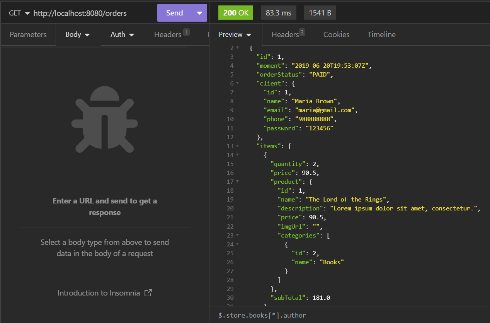

### Busca usuário por `id`

| Método | URL                               | Descrição              |
|--------|-----------------------------------|------------------------|
| GET    | http://localhost:8080/users/ `id` | Busca usuário por `id` |

#### Saída:
##### Status code 200 OK

###### Ex:
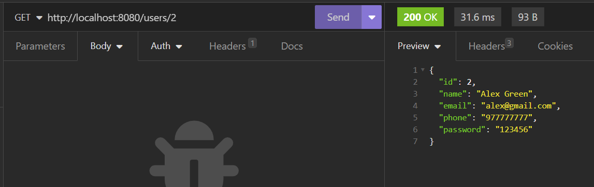

### Busca categoria por `id`

| Método | URL                                    | Descrição                |
|--------|----------------------------------------|--------------------------|
| GET    | http://localhost:8080/categories/ `id` | Busca categoria por `id` |

#### Saída:
##### Status code 200 OK

###### Ex:
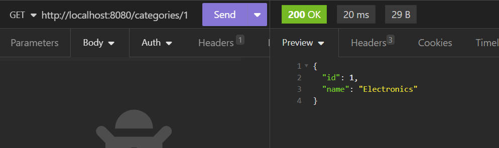

### Busca produto por `id`, associado a sua categoria

| Método | URL                                  | Descrição              |
|--------|--------------------------------------|------------------------|
| GET    | http://localhost:8080/products/ `id` | Busca produto por `id` |

#### Saída:
##### Status code 200 OK

###### Ex:
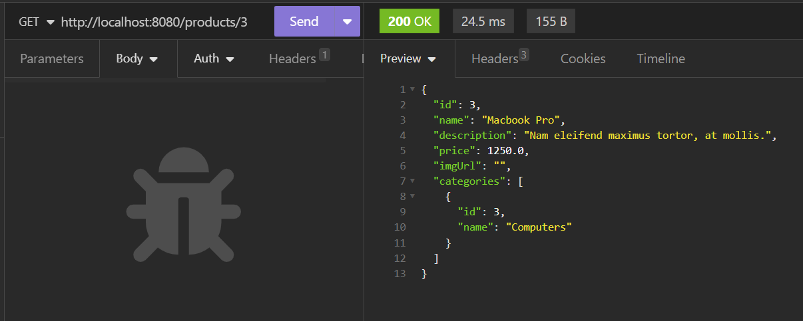

### Busca  ordem por um `id`, com as informações de produtos, quantidade de produtos, usuário solicitante, subtotal, total e situação de pagamento

| Método | URL                                | Descrição                      |
|--------|------------------------------------|--------------------------------|
| GET    | http://localhost:8080/orders/ `id` | Busca ordem de pedido por `id` |

#### Saída:
##### Status code 200 OK

###### Ex:
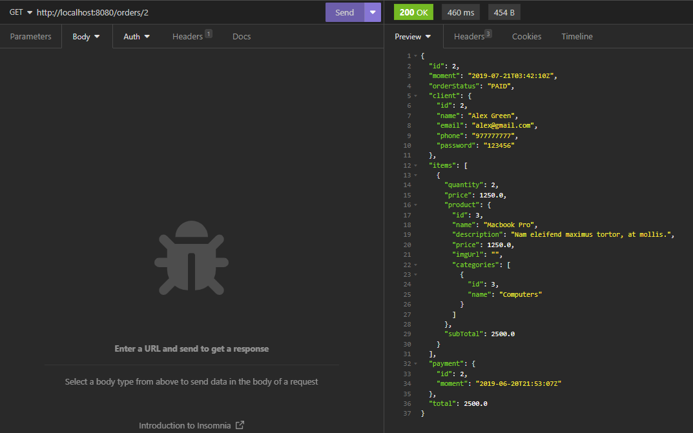

### Atualização de informações de um usuário por `id`

| Método | URL                               | Descrição                 |
|--------|-----------------------------------|---------------------------|
| PUT    | http://localhost:8080/users/ `id` | Atualiza usuário por `id` |  

#### Entradas:

| Nome campo   | Tipo   | Descrição             |
|--------------|--------|-----------------------|
| name         | String | Nome do usuário       |
| email        | String | Email do usuário      |
| phone        | String | Telefone do usuário   |

#### Saída:

##### Status code 200 OK

| Nome campo    | Tipo   | Descrição              |
|---------------|--------|------------------------|
| id            | UUID   | `id` gerado pelo banco |
| name          | String | Nome do usuário        |
| email         | String | Email do usuário       |
| phone         | String | Telefone do usuário    |
| password      | String | senha cadastrada       |
###### Ex:
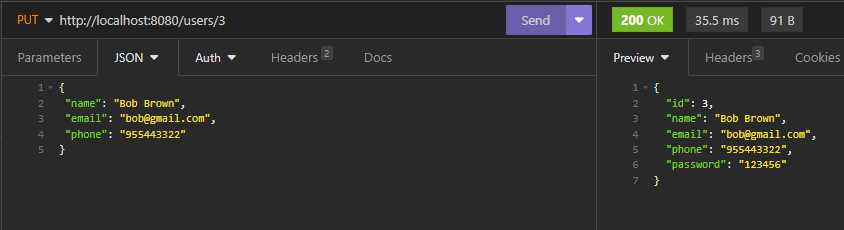

### Exclusão de um usuário por `id`.

| Método | URL                               | Descrição               |
|--------|-----------------------------------|-------------------------|
| DELETE | http://localhost:8080/users/ `id` | Exclui usuário por `id` |

#### Saída:
##### Status code 204 No Content

###### Ex:
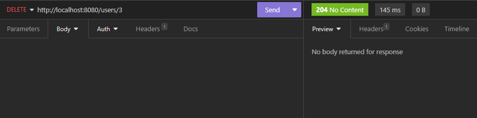